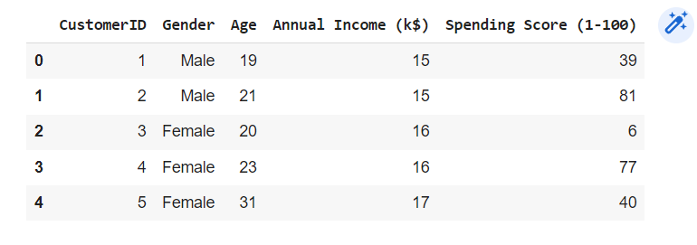
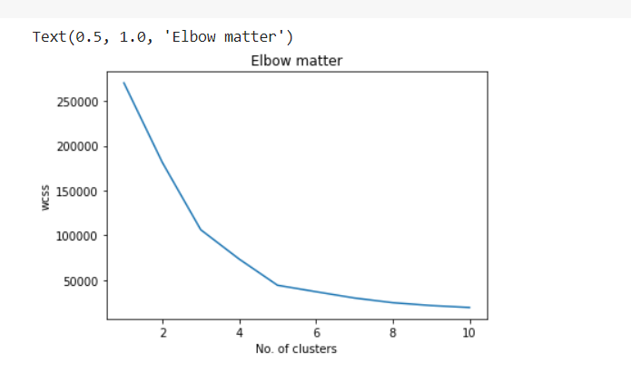
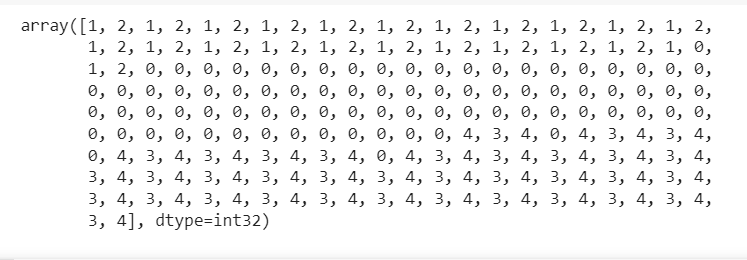

# Implementation-of-K-Means-Clustering-for-Customer-Segmentation

## AIM:
To write a program to implement the K Means Clustering for Customer Segmentation.

## Equipments Required:
1. Hardware – PCs
2. Anaconda – Python 3.7 Installation / Jupyter notebook

## Algorithm
1.Import the required libraries.

2.Read the data set and find the number of null data.

3.Import KMeans from sklearn.clusters library package.

4.Find the y_pred .

5.Plot the clusters in graph.

## Program:

Program to implement the K Means Clustering for Customer Segmentation.

Developed by: M.Sowmya

RegisterNumber:  212221230107

```
import numpy as np
import pandas as pd
import matplotlib.pyplot as plt
data=pd.read_csv("Mall_Customers (1).csv")

data.head()

data.info()

data.isnull().sum()

from sklearn.cluster import KMeans
wcss=[]

for i in range (1,11):
    kmeans=KMeans(n_clusters = i,init="k-means++")
    kmeans.fit(data.iloc[:,3:])
    wcss.append(kmeans.inertia_)

plt.plot(range(1,11),wcss)
plt.xlabel("No. of clusters")
plt.ylabel("wcss")
plt.title("Elbow matter")

km=KMeans(n_clusters=5)
km.fit(data.iloc[:,3:])

y_pred=km.predict(data.iloc[:,3:])
y_pred

data["cluster"]=y_pred
df0=data[data["cluster"]==0]
df1=data[data["cluster"]==1]
df2=data[data["cluster"]==2]
df3=data[data["cluster"]==3]
df4=data[data["cluster"]==4]
plt.scatter(df0["Annual Income (k$)"],df0["Spending Score (1-100)"],c="red",label="cluster0")
plt.scatter(df1["Annual Income (k$)"],df1["Spending Score (1-100)"],c="black",label="cluster1")
plt.scatter(df2["Annual Income (k$)"],df2["Spending Score (1-100)"],c="blue",label="cluster2")
plt.scatter(df3["Annual Income (k$)"],df3["Spending Score (1-100)"],c="green",label="cluster3")
plt.scatter(df4["Annual Income (k$)"],df4["Spending Score (1-100)"],c="magenta",label="cluster4")
plt.legend()
plt.title("Customer Segmets")
```
## Output:







## Result:
Thus the program to implement the K Means Clustering for Customer Segmentation is written and verified using python programming.
